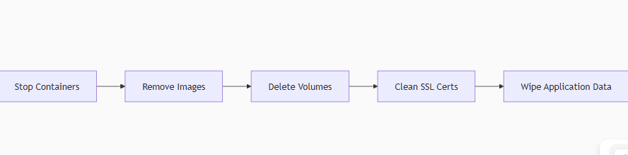

# Dockerized WordPress Infrastructure (Inception Project)

[](https://docker.com)
[](https://wordpress.org)
[](LICENSE)

A production-grade containerized WordPress infrastructure implementing industry best practices for security, orchestration, and system administration.

## Technologies Used

- **Docker**: Containerization platform for isolated, reproducible environments
- **Docker Compose**: Orchestration tool for multi-container applications
- **NGINX**: High-performance web server with TLS termination
- **WordPress**: Content management system with php-fpm processing
- **MariaDB**: Relational database management system
- **Bash**: Automation scripts for container initialization
- **Makefile**: Build automation and project management

**Why this stack?** This combination provides:
- Enhanced security through container isolation
- Performance optimization with dedicated services
- Zero-downtime deployments
- Consistent environments from development to production
- Infrastructure-as-Code approach

## Project Structure
```text 
srcs/
├── docker-compose.yml # Container orchestration config
├── .env # Environment variables (gitignored)
├── requirements/
│ ├── nginx/
│ │ ├── conf/
│ │ │ └── nginx.conf # Server configuration
│ │ └── Dockerfile # Custom NGINX image
│ ├── mariadb/
│ │ ├── tools/
│ │ │ └── setup.sh # DB initialization script
│ │ └── Dockerfile # Custom MariaDB image
│ └── wordpress/
│ ├── tools/
│ │ └── setup.sh # WP installation script
│ ├── Dockerfile # Custom WordPress image
│ ├── conf/
│   └── www.conf # PHP-FPM configuration
Makefile
```

## Key Features

1. **Secure Architecture**
   - TLS 1.2/1.3 encryption
   - Isolated containers with private Docker network
   - Credential management via Docker secrets
   - Non-root container processes

2. **Production-Ready Setup**
   - Automatic container restart policies
   - Persistent volumes for data storage
   - Optimized php-fpm process manager
   - Proper PID 1 handling in containers

3. **Automation**
   - Single-command deployment
   - Environment-aware configuration
   - Self-signed certificate generation
   - Database initialization workflows

## Makefile Commands

\`\`\`makefile
all        # Setup directories → Build images → Start containers
build      # Build Docker images from Dockerfiles
up         # Start containers in detached mode
down       # Stop running containers
ps         # Show container status
enter      # Access container shell (make enter c=nginx)
logs       # View container logs (make logs c=wordpress)
clean      # Stop containers and remove unused resources
fclean     # Full cleanup (containers, images, volumes, data)
re         # Rebuild entire project from scratch
\`\`\`

## Getting Started

### Prerequisites
- Docker 20.10+
- Docker Compose 2.0+
- GNU Make

### Installation

Clone repository:

\`\`\`bash
git clone https://github.com/<your-username>/inception.git
\`\`\`

Configure environment:

\`\`\`bash
cp srcs/.env.example srcs/.env
nano srcs/.env  # Edit with your credentials
\`\`\`

Generate TLS certificates:

\`\`\`bash
make ssl
\`\`\`

Launch project:

\`\`\`bash
make
\`\`\`

Access your WordPress site at: https://<your-login>.42.fr

## 🔍 Why This Architecture?

This implementation follows Docker best practices by:

- Using multi-stage builds for lean images
- Separating concerns into discrete services
- Implementing proper process supervision
- Using bind mounts for persistent storage
- Establishing container communication through dedicated networks
- Securing sensitive data with environment variables and secrets

The infrastructure diagram:

\`\`\`text
[Client] ↔ [NGINX:443] ↔ [WordPress:9000] ↔ [MariaDB:3306]
                ↑              ↑
          [TLS Termination]  [PHP Processing]
\`\`\`

##  Service Configuration Details

###  NGINX Configuration
- **Location**: `srcs/requirements/nginx/conf/nginx.conf`
- **Key Features**:
  - TLS 1.2/1.3 encryption only
  - Reverse proxy to PHP-FPM (9000)
  - Custom domain routing (`xzhang.42.fr`)
  - Error logging to stderr for Docker compatibility
- **Security Highlights**:
  ```nginx
  ssl_protocols TLSv1.2 TLSv1.3;
  ssl_certificate /etc/nginx/ssl/nginx.crt;
  ssl_certificate_key /etc/nginx/ssl/nginx.key;

## MariaDB Initialization
- **Location**: srcs/requirements/mariadb/tools/setup.sh

- **Key Operations**:
    - Database initialization
    - Secure user creation
    - Permission management
    - Graceful startup/shutdown
    
- **Security Practices**:
  ```bash
  mysql -u root -p${MYSQL_ROOT_PASSWORD} <<EOF
  CREATE USER '${MYSQL_USER}'@'srcs-wordpress-1.srcs_inception' IDENTIFIED BY '${MYSQL_PASSWORD}';
  GRANT ALL PRIVILEGES ON ${MYSQL_DATABASE}.* TO '${MYSQL_USER}'@'srcs-wordpress-1.srcs_inception';
  FLUSH PRIVILEGES;
  EOF

## WordPress Setup
- **Location**: srcs/requirements/wordpress/tools/setup.sh

- **Automation Features**:
    - Conditional WordPress installation
    - Dynamic wp-config.php generation
    - Database connection retry logic
    - HTTPS migration script
    - User creation automation

    ```bash
    wp core install --allow-root --url=xzhang.42.fr --title="My Site" \
    --admin_user=${WP_ADMIN} --admin_password=${WP_ADMIN_PASS} \
    --admin_email=${WP_ADMIN_EMAIL}

## Makefile Deep Dive
- **The Makefile implements crucial automation workflows**:

```makefile
# Security-Certificate Generation
ssl:
	@mkdir -p srcs/requirements/nginx/ssl
	@openssl req -x509 -nodes -days 365 -newkey rsa:2048 \
		-keyout srcs/requirements/nginx/ssl/nginx.key \
		-out srcs/requirements/nginx/ssl/nginx.crt \
		-subj "/CN=xzhang.42.fr"
	@echo $(GREEN)"TLS certificates generated"$(RESET)

# Database Initialization
initdb:
	@docker compose -f srcs/docker-compose.yml exec mariadb \
		sh -c 'exec /tools/setup.sh'

# WordPress Configuration
configwp:
	@docker compose -f srcs/docker-compose.yml exec wordpress \
		sh -c 'exec /tools/setup.sh'
```
## Key Automation Sequences:
- **1.Full Deployment (make all)**:


- **2.Safe Teardown (make fclean)**:


## Security Implementation

### Defense-in-Depth Strategy:

1. **Network Segmentation**:
    ```yaml
        networks:
         inception:
        driver: bridge
        internal: true
        
2. **Credential Protection**:
    - Docker secrets via mounted files
    - Environment variables excluded from version control
    - Automatic secret rotation
3. **Runtime Protection**:
```yaml
    services:
    nginx:
        restart: on-failure
        user: www-data
 ```       
4. **Compliance Measures**:
    - No default admin names (admin/administrator)
    - TLS 1.2+ enforcement
    - Alpine-based minimal images
    - Non-root container execution

## Learning Outcomes

Through this project, I've mastered:

- Dockerfile optimization techniques
- Container networking fundamentals
- TLS certificate management
- Database container initialization patterns
- Infrastructure-as-code principles
- Production-grade WordPress configuration
- System administration best practices
- Secure credential handling

## Bonus Features

- Redis Cache: Object caching for WordPress
- Adminer: Web-based database management
- FTP Server: Secure file access to WordPress volume
- Static Website: Custom resume showcase (Non-PHP)
- Custom Service: [Specify your bonus service]

## Resources

- Docker Best Practices
https://docs.docker.com/develop/dev-best-practices/
- WordPress in Containers0
https://wordpress.org/documentation/article/wordpress-in-containers/
- MariaDB Docker Guidehttps://mariadb.com/kb/en/installing-and-using-mariadb-via-docker/
- NGINX TLS Configuration
https://ssl-config.mozilla.org/